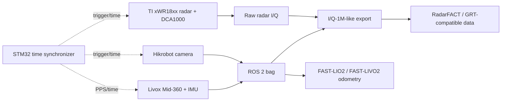

# RadarFACT-Hardware

[简体中文](README_zh-CN.md)

Open hardware, acquisition, calibration, and data-preparation resources for a
RadarFACT-oriented radar-camera-LiDAR research platform.

> [!IMPORTANT]
> This independent reproduction and extension is built on the substantial
> open-source contributions of the GRT team. The GRT paper, project website,
> research code, Red Rover collector, and NRDK tooling established the
> foundation that made this work possible. Please visit and cite the original
> [GRT project](https://wiselabcmu.github.io/grt/),
> [paper](https://arxiv.org/abs/2509.12482),
> [research code](https://github.com/WiseLabCMU/grt),
> [Red Rover](https://radarml.github.io/red-rover/), and
> [NRDK](https://radarml.github.io/nrdk/).

This repository focuses on the **hardware and data front end**. It does not
contain the complete RadarFACT training/inference backend or pretrained model
weights. The repository is under active development and will be updated as
hardware synchronization, odometry, online radar processing, and deployment
work progresses.

## System overview



The current rig uses a Jetson Orin Nano-class computer, a TI xWR18xx radar
with DCA1000 raw capture, a Livox Mid-360, a Hikrobot camera, and an STM32
synchronization board. Hardware documents in the archive reference closely
related IWR1834/AWR1843-class boards; verify the exact board, firmware, and
modulation profile for every recording session.

## Repository layout

```text
RadarFACT-Hardware/
├── docs/                       # Architecture, data flow, limitations, upstream credits
├── firmware/stm32-timesync/    # STM32F10x timer/synchronization firmware
├── hardware/
│   ├── cad/printable/          # STL/3MF files
│   ├── cad/source/             # SolidWorks source models
│   └── docs/                   # Hardware and wiring documents
└── software/
    ├── acquisition/            # ROS 2 and Red Rover acquisition scripts
    ├── calibration/            # ChArUco and radar visualization tools
    └── iq1m_tools/             # Export, alignment, projection, and cache tools
```

## Data path

1. Record camera and Mid-360 topics in a ROS 2 bag.
2. Record raw radar I/Q through Red Rover and DCA1000.
3. Preserve sensor timestamps, host receive timestamps, and per-point Livox
   `offset_time` whenever available.
4. Export an I/Q-1M-like scene with `software/iq1m_tools/`.
5. Generate nearest-neighbour manifests, calibrated projections, and camera
   region caches for downstream radar-camera experiments.

See [docs/DATA_PIPELINE.md](docs/DATA_PIPELINE.md) for details.

## Quick start

The scripts target Ubuntu 22.04 and ROS 2 Humble. Install and validate the
vendor SDKs and drivers independently:

- Livox-SDK2 and `livox_ros_driver2`
- Hikrobot MVS SDK and a ROS 2 camera wrapper
- Red Rover and the radar/DCA1000 configuration
- Python 3 with NumPy, OpenCV, Matplotlib, PyYAML, and ReportLab

Start the three sensor backends, then record a session:

```bash
export DATA_ROOT=/mnt/sensor_data/demo_traces
export IMAGE_TOPIC=/image_raw
export LIDAR_TOPIC=/livox/lidar
export IMU_TOPIC=/livox/imu

bash software/acquisition/record_indoor_demo.sh indoor_forward_01
```

All paths and topics in the public scripts are examples. Override them through
environment variables and confirm them with `ros2 topic list` before recording.

## Calibration

Camera intrinsics in `software/calibration/camera_intrinsics_charuco.yaml` are
an example for one camera/lens/resolution combination. Do not reuse them after
changing the camera, lens, focus, resolution, ROI, or mechanical mounting.

Cross-sensor work also requires verified transform direction and units for:

- LiDAR to camera
- radar to camera
- LiDAR to IMU

See [docs/CALIBRATION.md](docs/CALIBRATION.md).

## Current status and limitations

- Raw radar, camera, and Mid-360 acquisition tools are included.
- I/Q-1M-like export and Mid-360 native-point preservation tools are included.
- The STM32 firmware is an engineering starting point; trigger polarity,
  voltage, pulse width, phase, and device support must be verified on a scope.
- Hardware synchronization is not yet claimed as fully validated end to end.
- The original data workflow used nearest-neighbour timestamp association.
- Online RadarFACT inference and full 6-DoF radar odometry are future work.
- No raw recordings or model weights are distributed in this repository.

See [docs/KNOWN_LIMITATIONS.md](docs/KNOWN_LIMITATIONS.md) before using the
system for quantitative experiments.

## Roadmap

- [ ] Validate hardware triggering and timestamp-to-frame association
- [ ] Record Mid-360 IMU and verify per-point deskew timing
- [ ] Add reproducible LiDAR-camera and radar-camera calibration examples
- [ ] Establish FAST-LIO2/FAST-LIVO2 odometry baselines
- [ ] Replace placeholder poses with measured trajectories
- [ ] Bridge live radar frames to an in-memory 4-D FFT pipeline
- [ ] Add RadarFACT online inference and diagnostic ROS 2 nodes
- [ ] Publish example sequences and reproducible evaluation scripts

## Acknowledgements and upstream work

This project would not exist without the GRT authors' work on scalable raw
single-chip radar collection, I/Q-1M, Red Rover, NRDK, and the Generalizable
Radar Transformer. Their open system design, datasets, tooling, and research
code provided the technical baseline for this reproduction and its planned
RadarFACT extensions. We encourage users to study, cite, and contribute to the
official upstream projects first.

This repository is an independent project and is not endorsed by or affiliated
with Carnegie Mellon University, Bosch Research, the University of
Wisconsin-Madison, or the GRT authors.

## Citation

When this repository is useful, please cite the original GRT work:

```bibtex
@article{huang2025towards,
  title   = {Towards Foundational Models for Single-Chip Radar},
  author  = {Huang, Tianshu and Prabhakara, Akarsh and Chen, Chuhan and
             Karhade, Jay and Ramanan, Deva and O'Toole, Matthew and Rowe, Anthony},
  journal = {arXiv preprint arXiv:2509.12482},
  year    = {2025}
}
```

## License

Original code and documentation in this repository are released under the MIT
License unless a file or directory states otherwise. Third-party firmware,
vendor material, upstream code, and file formats retain their original terms.
See [THIRD_PARTY_NOTICES.md](THIRD_PARTY_NOTICES.md).

